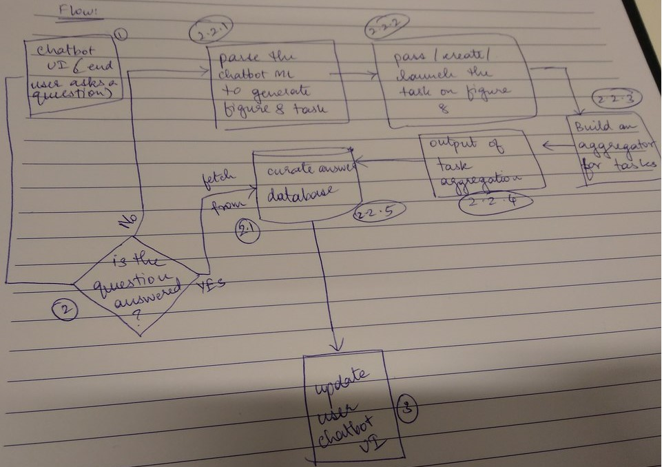

# CS 4145: Crowd computing

**Project: Building a chatbor for the CampusIR project**

### About
The project builds a chatbot using Program-O which interacts with a crowdsourcing platform like Figure8 to help students and other at TU Delft find a table to work, study or eat based on their location. The following flowchart is an overview of the information flow in this project.

