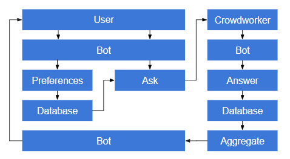

# MyCI - My Campus Information Chatbot

This is a Telegram-bot which is designed and developed as part of the CS4145: Crowd Computing course at the Delft University of Technology by team *CrowdIT* - [Neha Sree Thuraka](https://github.com/nehasreet), [Sharad Shriram](https://github.com/sharadshriram), [Salim Salmi](https://github.com/SalimSalmi), [Yizi Chen](https://github.com/chenyizi086). The use case for which the chatbot is developed is course recommendation using the concept of crowd computing. This is prototype is based on the following flowchart,

## Using the chatbot
The chatbot is accessible at . However, ping us on the course slack channel for you to interact with the chatbot. Once you are inside the chatbot, you can use the following commands to interact with it

    - `\start` starts the interaction with the chatbot
    - `\stop` stops the interaction with the chatbot
    - `\recommend` gives recommendations of courses based on user preferences
    - `\courses` updates the course preferences for the user.
    
## Project Structure
The project directories and files are structured in the following tree:
- `images` runs worker API, requester API and chatbot
- `python-bot`
    - `api_helper.py` helper methods to call the worker API
    - `chatbot.py` entry point of chatbot, uses messaging and logger functionality
    - `facebook_helper.py` helper methods to call Facebook API and Facebook-specific functionality
    - `local_test.py` tests communication with chatbot without having to use the Facebook interface
    - `logger.py` wraps (heroku) logging functionality
    - `messaging.py` logic to handle the chatbot interaction flow by reading user messages and replying according to current chatbot state
- `README.md`

## Setting Up

### Installations

### Local Testing
